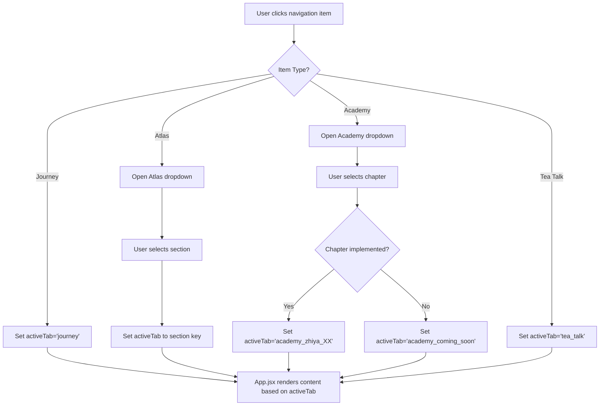

# Tea Website - Architecture & Routing Documentation

> **Purpose**: Complete reference for understanding the application structure, routing system, and navigation flow. Essential for AI collaboration and future modifications.

---

## Table of Contents

1. [Application Structure Overview](#application-structure-overview)
2. [Routing System](#routing-system)
3. [Navigation Flow](#navigation-flow)
4. [Key Components Reference](#key-components-reference)
5. [How to Add/Modify Features](#how-to-addmodify-features)
6. [Common Modification Scenarios](#common-modification-scenarios)

---

## Application Structure Overview

### Core Architecture

```
tea-website/
├── src/
│   ├── App.jsx                          # Main application entry (3,477 lines)
│   ├── main.jsx                         # React root
│   ├── components/                      # Reusable UI components
│   │   ├── SiteNavigation.jsx          # Top navigation bar (841 lines) ⭐
│   │   ├── academy/
│   │   │   ├── AcademyRouter.jsx       # Academy routing logic (167 lines) ⭐
│   │   │   ├── AcademyChapter.jsx      # Chapter wrapper component
│   │   │   ├── AcademySection.jsx      # Section container
│   │   │   ├── AcademyContentBlock.jsx # Content block
│   │   │   └── AcademyHighlightBox.jsx # Highlight box
│   │   └── sections/                    # Page sections
│   ├── content/                         # Content components
│   │   ├── academy/                     # Academy chapter content
│   │   │   ├── ZhiyaChapter02.jsx      # 質雅 chapters
│   │   │   ├── XueyaChapter03.jsx      # 學雅 chapters
│   │   │   └── ...
│   │   ├── featured/                    # Featured tea articles
│   │   ├── varieties/                   # Tea varieties content
│   │   └── ...
│   ├── config/
│   │   └── navigation.js                # Navigation configuration ⭐
│   └── i18n/
│       └── translations.js              # Internationalization
```

⭐ = Critical files for navigation/routing modifications

---

## Routing System

### 1. Tab-Based Routing (Single Page Application)

The application uses a **tab-based routing system** managed by the `activeTab` state in `App.jsx`.

**Key State**:
```javascript
// In App.jsx (line ~86)
const [activeTab, setActiveTab] = useState('journey');
```

**Tab Values**:
- `'journey'` - Homepage/Journey section
- `'home'` - Atlas home
- `'varieties'` - Tea varieties
- `'cultivars'` - Tea cultivars
- `'science'` - Tea science
- `'featured_*'` - Featured tea articles (e.g., `'featured_tieguanyin'`)
- `'academy_zhiya_02'` - Academy chapters (e.g., `'academy_zhiya_02'`, `'academy_xueya_05'`)
- `'sensory'` - Sensory training
- `'tea_talk'` - Tea talk section
- ... and more

### 2. Navigation Configuration

**File**: [navigation.js](file:///d:/tea-website/src/config/navigation.js)

Defines navigation structure for various sections:

```javascript
export const NAV_ITEMS = [
  'journey',
  'home',
  'varieties',
  'cultivars',
  'science',
  'featured',
  'sensory',
  'tea_talk',
  // ... more items
];

export const VARIETIES_KINDS = [
  { key: 'ref_chenchuan', label: '陳川茶分類' },
  { key: 'oolong', label: '烏龍茶產區' },
  // ...
];

export const CHEN_CHUAN_TOC = [
  { href: '#cc-all', label: '完整分類' },
  // ...
];
```

### 3. Academy Routing (Centralized)

**File**: [AcademyRouter.jsx](file:///d:/tea-website/src/components/academy/AcademyRouter.jsx)

**Configuration Object**:
```javascript
const ACADEMY_CHAPTERS = {
  academy_zhiya_02: {
    component: ZhiyaChapter02,
    category: '大觀書院 · 質雅',
    title: '第二堂：清香型茶的品質探討',
    intro: '...'
  },
  academy_zhiya_03: { /* ... */ },
  // ... 15 more chapters
};
```

**Routing Logic**:
```javascript
export default function AcademyRouter({ activeTab, museumUnlocked }) {
  if (!museumUnlocked || !activeTab.startsWith('academy_')) {
    return null;
  }
  
  const chapter = ACADEMY_CHAPTERS[activeTab];
  
  if (!chapter) {
    return <ComingSoonPage />;
  }
  
  const ChapterComponent = chapter.component;
  return (
    <AcademyChapter category={chapter.category} title={chapter.title} intro={chapter.intro}>
      <ChapterComponent />
    </AcademyChapter>
  );
}
```

---

## Navigation Flow

### Desktop Navigation Flow



### Navigation Component Hierarchy

```
SiteNavigation.jsx (Top Navigation Bar)
├── Desktop Navigation (xl:flex)
│   ├── Journey Button → goToTab('journey')
│   ├── Atlas Dropdown
│   │   ├── Varieties → goToTab('varieties')
│   │   ├── Cultivars → goToTab('cultivars')
│   │   ├── Science → goToTab('science')
│   │   └── Featured → goToTab('featured')
│   ├── Tea Talk Button → goToTab('tea_talk')
│   ├── Academy Dropdown (if museumUnlocked)
│   │   ├── 質雅 (Zhiya)
│   │   │   ├── Chapter 02 → goToTab('academy_zhiya_02')
│   │   │   ├── Chapter 03 → goToTab('academy_zhiya_03')
│   │   │   └── ... (8 chapters total)
│   │   └── 學雅 (Xueya)
│   │       ├── Chapter 03 → goToTab('academy_xueya_03')
│   │       ├── Chapter 05 → goToTab('academy_xueya_05')
│   │       └── ... (7 chapters total)
│   └── Sensory Button → goToTab('sensory')
│
└── Mobile Navigation (xl:hidden)
    └── (Similar structure with accordions)
```

---

## Key Components Reference

### 1. SiteNavigation.jsx

**Location**: [SiteNavigation.jsx](file:///d:/tea-website/src/components/SiteNavigation.jsx)

**Purpose**: Top navigation bar with dropdowns

**Key Functions**:
```javascript
// Check if Academy chapter is implemented
const isAcademyImplemented = (catKey, num) => {
  const implemented = {
    zhiya: ['02', '03', '04', '05', '06', '07', '09', '10'],
    xueya: ['03', '05', '06', '07', '08', '09', '11']
  };
  return implemented[catKey]?.includes(num);
};
```

**Academy Structure Configuration** (lines 20-63):
```javascript
const ACADEMY_STRUCTURE = [
  {
    key: 'xueya',
    label: '學雅',
    chapters: [
      { id: '01', title: '' },
      { id: '02', title: '' },
      { id: '03', title: '儀軌教學 / 茶荷置茶法' },
      // ... more chapters
    ],
    prefix: '/academy/xueya/',
  },
  {
    key: 'zhiya',
    label: '質雅',
    chapters: [
      { id: '01', title: '紅烏龍 / 懸空置茶法' },
      // ... more chapters
    ],
    prefix: '/academy/zhiya/',
  },
];
```

**Desktop Academy Dropdown onClick Handler** (lines 461-485):
```javascript
onClick={(e) => {
  e.preventDefault();
  if (cat.key === 'zhiya') {
    if (parseInt(num, 10) === 10) goToTab('academy_zhiya_10');
    else if (parseInt(num, 10) === 2) goToTab('academy_zhiya_02');
    // ... more conditions
    else goToTab('academy_coming_soon');
  } else if (cat.key === 'xueya') {
    if (parseInt(num, 10) === 3) goToTab('academy_xueya_03');
    // ... more conditions
    else goToTab('academy_coming_soon');
  }
  setAcademyNavOpen(false);
}}
```

**Mobile Academy Dropdown onClick Handler** (lines 620-645): Similar structure

### 2. App.jsx

**Location**: [App.jsx](file:///d:/tea-website/src/App.jsx)

**Purpose**: Main application component with routing logic

**Key State** (lines 86-100):
```javascript
const [activeTab, setActiveTab] = useState('journey');
const [mobileMenuOpen, setMobileMenuOpen] = useState(false);
const [atlasNavOpen, setAtlasNavOpen] = useState(true);
const [museumUnlocked, setMuseumUnlocked] = useState(false);
// ... more state
```

**goToTab Function** (lines 130-217):
```javascript
const goToTab = (tab) => {
  setActiveTab(tab);
  setMobileMenuOpen(false);
  
  // Special handling for certain tabs
  if (tab === 'varieties') {
    setVarietiesKind('ref_chenchuan');
  }
  if (tab === 'cultivars') {
    // ...
  }
  // ... more logic
  
  window.scrollTo({ top: 0, behavior: 'smooth' });
};
```

**Allowed Tabs Set** (lines 220-226):
```javascript
const allowed = new Set([
  ...NAV_ITEMS,
  'academy_zhiya_04', 'academy_zhiya_05', /* ... */,
  'academy_xueya_03', 'academy_xueya_05', /* ... */,
  'academy_coming_soon'
]);
```

**Conditional Rendering** (lines 3300-3482):
```javascript
{activeTab === 'journey' && <JourneySection />}
{activeTab === 'home' && <HomeSection />}
{activeTab === 'varieties' && <VarietiesSection />}
// ... more sections

{/* Academy Section - Centralized routing */}
<AcademyRouter activeTab={activeTab} museumUnlocked={museumUnlocked} />
```

### 3. AcademyRouter.jsx

**Location**: [AcademyRouter.jsx](file:///d:/tea-website/src/components/academy/AcademyRouter.jsx)

**Purpose**: Centralized Academy chapter routing

**Imports** (lines 4-18):
```javascript
import ZhiyaChapter02 from '../../content/academy/ZhiyaChapter02';
import ZhiyaChapter03 from '../../content/academy/ZhiyaChapter03';
// ... 14 more imports
```

**Configuration** (lines 24-146):
```javascript
const ACADEMY_CHAPTERS = {
  academy_zhiya_02: { component, category, title, intro },
  academy_zhiya_03: { /* ... */ },
  // ... 14 more chapters
};
```

**Routing Component** (lines 157-189):
```javascript
export default function AcademyRouter({ activeTab, museumUnlocked }) {
  if (!museumUnlocked || !activeTab.startsWith('academy_')) {
    return null;
  }
  
  const chapter = ACADEMY_CHAPTERS[activeTab];
  
  if (!chapter) {
    return <ComingSoonPage />;
  }
  
  const ChapterComponent = chapter.component;
  return (
    <AcademyChapter {...chapter}>
      <ChapterComponent />
    </AcademyChapter>
  );
}
```

---

## How to Add/Modify Features

### Adding a New Academy Chapter

**Step 1**: Create chapter content file
```bash
# Create new file
d:\tea-website\src\content\academy\ZhiyaChapter01.jsx
```

**Step 2**: Add to AcademyRouter.jsx
```javascript
// 1. Add import (line ~18)
import ZhiyaChapter01 from '../../content/academy/ZhiyaChapter01';

// 2. Add to ACADEMY_CHAPTERS (line ~24)
const ACADEMY_CHAPTERS = {
  academy_zhiya_01: {
    component: ZhiyaChapter01,
    category: '大觀書院 · 質雅',
    title: '第一堂：當代茶事概論',
    intro: '...'
  },
  // ... existing chapters
};
```

**Step 3**: Update SiteNavigation.jsx
```javascript
// 1. Add to isAcademyImplemented (line ~173)
const implemented = {
  zhiya: ['01', '02', '03', /* ... */],
  xueya: ['03', '05', /* ... */]
};

// 2. Add onClick handler (line ~463)
if (cat.key === 'zhiya') {
  if (parseInt(num, 10) === 1) goToTab('academy_zhiya_01');
  else if (parseInt(num, 10) === 2) goToTab('academy_zhiya_02');
  // ...
}

// 3. Add mobile onClick handler (line ~622) - same logic
```

**Step 4**: Update App.jsx allowed set (line ~220)
```javascript
const allowed = new Set([
  ...NAV_ITEMS,
  'academy_zhiya_01', // Add this
  'academy_zhiya_02',
  // ...
]);
```

### Adding a New Top-Level Navigation Item

**Step 1**: Add to navigation.js
```javascript
// In config/navigation.js
export const NAV_ITEMS = [
  'journey',
  'home',
  'my_new_section', // Add here
  // ...
];
```

**Step 2**: Add to SiteNavigation.jsx
```javascript
// Add button in desktop navigation (line ~200)
<button
  type="button"
  onClick={() => goToTab('my_new_section')}
  className="nav-pill nav-pill--tier1"
>
  My New Section
</button>

// Add to mobile navigation (line ~536)
<button
  type="button"
  onClick={() => goToTab('my_new_section')}
  className="px-3 py-2 rounded-xl"
>
  My New Section
</button>
```

**Step 3**: Add rendering logic in App.jsx
```javascript
// Add conditional rendering (line ~3400)
{activeTab === 'my_new_section' && <MyNewSectionComponent />}
```

### Modifying Navigation Order

**Desktop Navigation Order** (SiteNavigation.jsx, line ~201-328):
```javascript
<div className="flex items-center gap-3">
  {/* Change order by reordering these buttons */}
  <button onClick={() => goToTab('journey')}>Journey</button>
  <button onClick={() => goToTab('atlas')}>Atlas</button>
  <button onClick={() => goToTab('tea_talk')}>Tea Talk</button>
  {/* Academy button */}
  <button onClick={() => goToTab('sensory')}>Sensory</button>
</div>
```

**Mobile Navigation Order** (SiteNavigation.jsx, line ~536-572):
```javascript
<div className="grid grid-cols-2 gap-2 px-2">
  {/* Change order by reordering these buttons */}
  <button onClick={() => goToTab('journey')}>Journey</button>
  <button onClick={() => goToTab('atlas')}>Atlas</button>
</div>
```

**Academy Chapter Order** (SiteNavigation.jsx, line ~20-63):
```javascript
const ACADEMY_STRUCTURE = [
  {
    key: 'xueya', // Change order by swapping these objects
    label: '學雅',
    chapters: [
      { id: '01', title: '' },
      { id: '02', title: '' },
      // Change chapter order by reordering this array
    ],
  },
  {
    key: 'zhiya',
    label: '質雅',
    // ...
  },
];
```

---

## Common Modification Scenarios

### Scenario 1: Change Academy Dropdown to Show Zhiya First

**File**: [SiteNavigation.jsx](file:///d:/tea-website/src/components/SiteNavigation.jsx)

**Change** (line ~20):
```javascript
// Before
const ACADEMY_STRUCTURE = [
  { key: 'xueya', label: '學雅', /* ... */ },
  { key: 'zhiya', label: '質雅', /* ... */ },
];

// After
const ACADEMY_STRUCTURE = [
  { key: 'zhiya', label: '質雅', /* ... */ }, // Swapped
  { key: 'xueya', label: '學雅', /* ... */ },
];
```

### Scenario 2: Move Tea Talk Before Academy

**File**: [SiteNavigation.jsx](file:///d:/tea-website/src/components/SiteNavigation.jsx)

**Change** (line ~260-308):
```javascript
// Before
<button onClick={() => goToTab('atlas')}>Atlas</button>
<button onClick={() => goToTab('tea_talk')}>Tea Talk</button>
{museumUnlocked && <button>Academy</button>}
<button onClick={() => goToTab('sensory')}>Sensory</button>

// After
<button onClick={() => goToTab('atlas')}>Atlas</button>
{museumUnlocked && <button>Academy</button>} {/* Moved up */}
<button onClick={() => goToTab('tea_talk')}>Tea Talk</button>
<button onClick={() => goToTab('sensory')}>Sensory</button>
```

### Scenario 3: Change Academy Chapter Title

**File**: [AcademyRouter.jsx](file:///d:/tea-website/src/components/academy/AcademyRouter.jsx)

**Change** (line ~24):
```javascript
const ACADEMY_CHAPTERS = {
  academy_zhiya_02: {
    component: ZhiyaChapter02,
    category: '大觀書院 · 質雅',
    title: '第二堂：清香型茶的品質探討', // Change this
    intro: '...' // Or change this
  },
  // ...
};
```

**Also update** [SiteNavigation.jsx](file:///d:/tea-website/src/components/SiteNavigation.jsx) (line ~27):
```javascript
const ACADEMY_STRUCTURE = [
  {
    key: 'xueya',
    label: '學雅',
    chapters: [
      { id: '03', title: '儀軌教學 / 茶荷置茶法' }, // Change this
      // ...
    ],
  },
];
```

### Scenario 4: Hide a Navigation Item Temporarily

**File**: [SiteNavigation.jsx](file:///d:/tea-website/src/components/SiteNavigation.jsx)

**Method 1**: Comment out the button
```javascript
{/* Temporarily hidden
<button onClick={() => goToTab('sensory')}>Sensory</button>
*/}
```

**Method 2**: Add conditional rendering
```javascript
{false && <button onClick={() => goToTab('sensory')}>Sensory</button>}
```

---

## File Modification Quick Reference

| Task | Files to Modify | Lines |
|------|----------------|-------|
| Add new Academy chapter | `AcademyRouter.jsx`<br/>`SiteNavigation.jsx`<br/>`App.jsx` | ~18, ~24<br/>~173, ~463, ~622<br/>~220 |
| Change Academy chapter title | `AcademyRouter.jsx`<br/>`SiteNavigation.jsx` | ~24<br/>~27 |
| Reorder navigation items | `SiteNavigation.jsx` | ~201-328 (desktop)<br/>~536-572 (mobile) |
| Reorder Academy chapters | `SiteNavigation.jsx` | ~20-63 |
| Add new top-level nav item | `navigation.js`<br/>`SiteNavigation.jsx`<br/>`App.jsx` | NAV_ITEMS<br/>~201, ~536<br/>~3400 |
| Change Academy dropdown order | `SiteNavigation.jsx` | ~20 |

---

## Navigation State Flow Diagram

```
User Interaction
       ↓
SiteNavigation.jsx
  - Button onClick
  - Dropdown selection
       ↓
   goToTab(tabName)
       ↓
App.jsx: setActiveTab(tabName)
       ↓
   activeTab state updated
       ↓
Conditional Rendering
  - {activeTab === 'journey' && <JourneySection />}
  - {activeTab === 'varieties' && <VarietiesSection />}
  - <AcademyRouter activeTab={activeTab} />
       ↓
Component Rendered
```

---

## Important Notes for AI Collaboration

1. **Single Source of Truth**:
   - Academy chapter metadata: `AcademyRouter.jsx` (lines 24-146)
   - Academy navigation structure: `SiteNavigation.jsx` (lines 20-63)
   - Implemented chapters list: `SiteNavigation.jsx` (lines 172-177)

2. **Three Places to Update for New Academy Chapter**:
   - `AcademyRouter.jsx`: Add import + config
   - `SiteNavigation.jsx`: Update `isAcademyImplemented` + onClick handlers
   - `App.jsx`: Add to `allowed` Set

3. **Navigation Consistency**:
   - Desktop and mobile navigation must be updated together
   - Desktop: lines ~201-328
   - Mobile: lines ~536-645

4. **Tab Naming Convention**:
   - Academy: `academy_{category}_{number}` (e.g., `academy_zhiya_02`)
   - Featured: `featured_{tea_name}` (e.g., `featured_tieguanyin`)
   - Regular sections: lowercase with underscores (e.g., `tea_talk`)

5. **State Management**:
   - All routing state is in `App.jsx`
   - Navigation components receive `goToTab` as prop
   - No direct state manipulation in child components

---

## Troubleshooting

### Chapter Not Showing in Navigation

**Check**:
1. Is chapter ID in `isAcademyImplemented`? (SiteNavigation.jsx line ~173)
2. Is onClick handler added? (SiteNavigation.jsx line ~463 and ~622)
3. Is chapter in `allowed` Set? (App.jsx line ~220)

### Chapter Shows But Doesn't Load

**Check**:
1. Is chapter imported in `AcademyRouter.jsx`? (line ~4)
2. Is chapter in `ACADEMY_CHAPTERS` config? (line ~24)
3. Is component exported correctly from chapter file?

### Navigation Order Wrong

**Check**:
1. Desktop order: SiteNavigation.jsx lines ~201-328
2. Mobile order: SiteNavigation.jsx lines ~536-645
3. Academy chapter order: SiteNavigation.jsx lines ~20-63

---

**Last Updated**: 2026-01-11
**Maintained By**: AI Collaboration System
**Version**: 1.0
